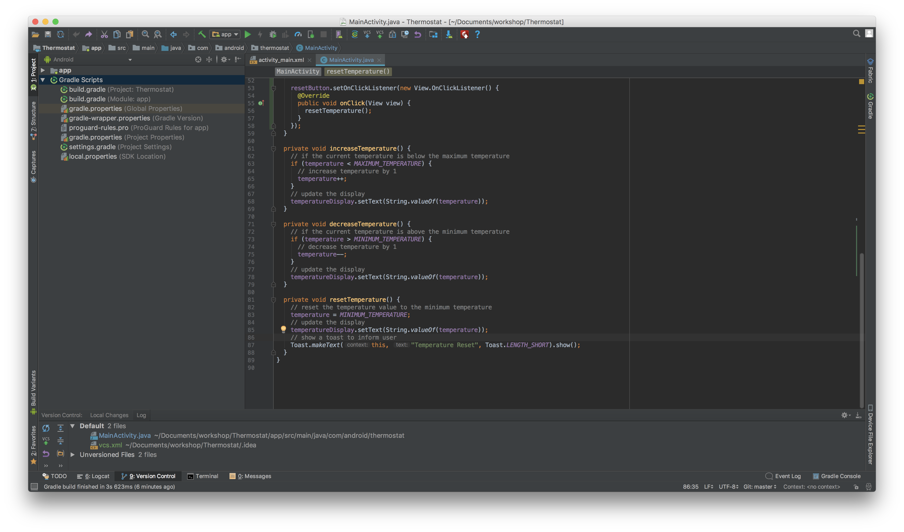

### Bonus: Set a minimum and maximum temperature

#### 6. Add a static variable for the minimum and maximum temperature

   At the start of the file, add the following:

   ```java
   private static final int MINIMUM_TEMPERATURE = 18;
   private static final int MAXIMUM_TEMPERATURE = 30;
   ```

   _`static final` indicates that these values cannot be changed programatically._

   Then assign the initial temperature value to `MINIMUM_TEMPERATURE`

   We’ll also replace the value in the reset method to `MINIMUM_TEMPERATURE`

   We can now add logic to ensure that our buttons will never let our temperature drop below the minimum or exceed the maximum value.

   In our `increaseTemperature` method, let’s add the following code:

   ```java    
   // if the current temperature is below the maximum temperature
    if (temperature < MAXIMUM_TEMPERATURE) {
      // increase temperature by 1
      temperature++;
    }
    // update the display
    temperatureDisplay.setText(String.valueOf(temperature));
   ```

Similarly, we perform the same checks for the `decreaseTemperature` method:

   ```java    
   // if the current temperature is above the minimum temperature
    if (temperature > MINIMUM_TEMPERATURE) {
      // decrease temperature by 1
      temperature--;
    }
    // update the display
    temperatureDisplay.setText(String.valueOf(temperature));
   ```

   Our code should now look something like this:

   
