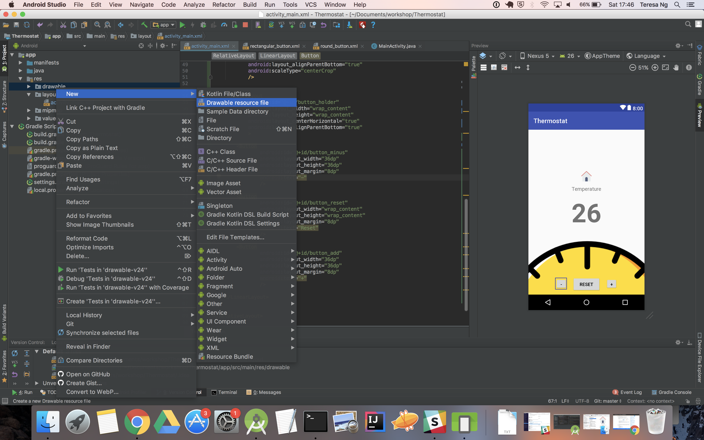

### Bonus: Let’s make the buttons pretty

   The default colour and shape for buttons might not work best for our app. We can change both the colour and shape of our buttons very easily by using an XML drawable called a `selector`.

   Like how we’re building our layouts in XML, Android Studio also allows us to build drawables in XML. The `selector` allows us to specify the appearance of this drawable at different states - like when the button is pressed and when it isn’t pressed. Within this drawable we’ll have a `shape` tag. We can create an XML drawable simply as a `shape` without the `selector`.

  For now, let’s have a look at how we can build this `selector` with the shapes.

#### 8. Create a selector

   Right-click the menu on the left again and select _New\Drawable Resource File_

   

   Name it `round_button`

   

   Replace the code in the file with the following:

   ```xml
   <?xml version="1.0" encoding="utf-8"?>
<selector xmlns:android="http://schemas.android.com/apk/res/android">
    <item android:state_pressed="false">
        <shape android:shape="oval">
            <solid android:color="#8EF8D2" />
            <size android:height="50dp" android:width="50dp" />
        </shape>
    </item>
    <item android:state_pressed="true">
        <shape android:shape="oval">
            <solid android:color="#B9DACE" />
            <size android:height="50dp" android:width="50dp" />
        </shape>
    </item>
</selector>
```

   

   Now let’s create another drawable for our reset button as we don’t want this button to be a round button. This time around, we’ll make it a rounded rectangle (so `rectangular_button` will make a good name) with the following code:

   ```xml
   <?xml version="1.0" encoding="utf-8"?>
<selector xmlns:android="http://schemas.android.com/apk/res/android">
    <item android:state_pressed="false">
        <shape android:shape="rectangle">
            <solid android:color="#8EF8D2" />
            <size android:height="50dp" android:width="50dp" />
            <corners android:radius="8dp" />
        </shape>
    </item>
    <item android:state_pressed="true">
        <shape android:shape="rectangle">
            <solid android:color="#B9DACE" />
            <size android:height="50dp" android:width="50dp" />
            <corners android:radius="8dp" />
        </shape>
    </item>
</selector>
```

   
   
   Now we can apply it to our buttons by setting the drawable as a background - the round selector to the add and minus buttons, and the rectangular selector to the reset button.
   
   
   
   We can then adjust the size and spacing of the buttons to make them look a bit better if necessary.
