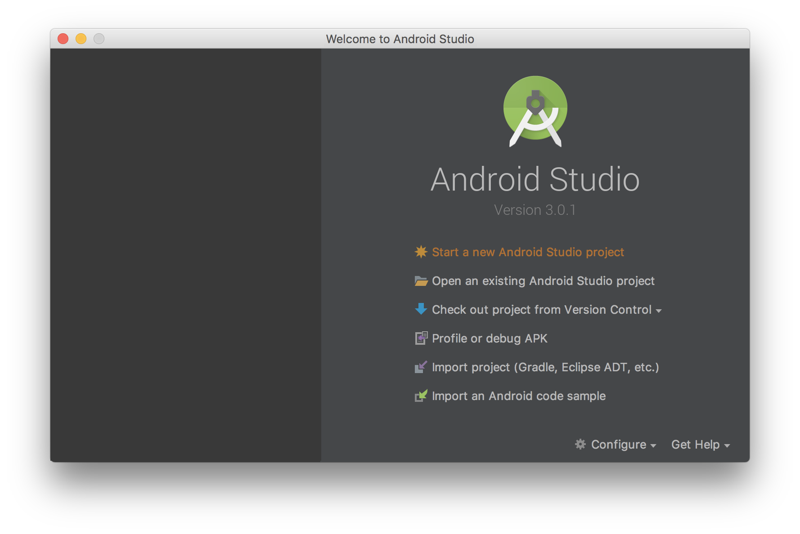
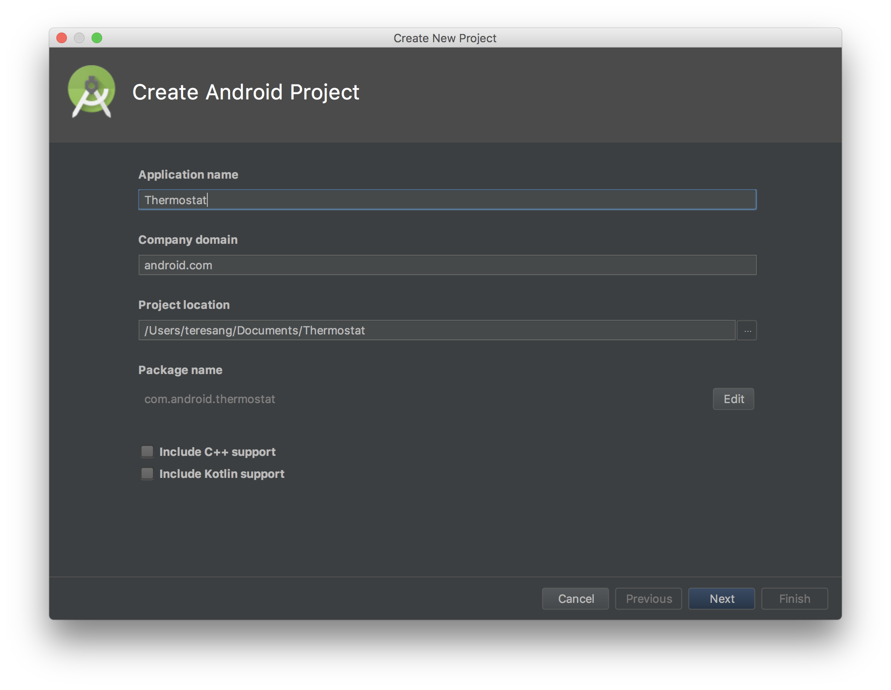
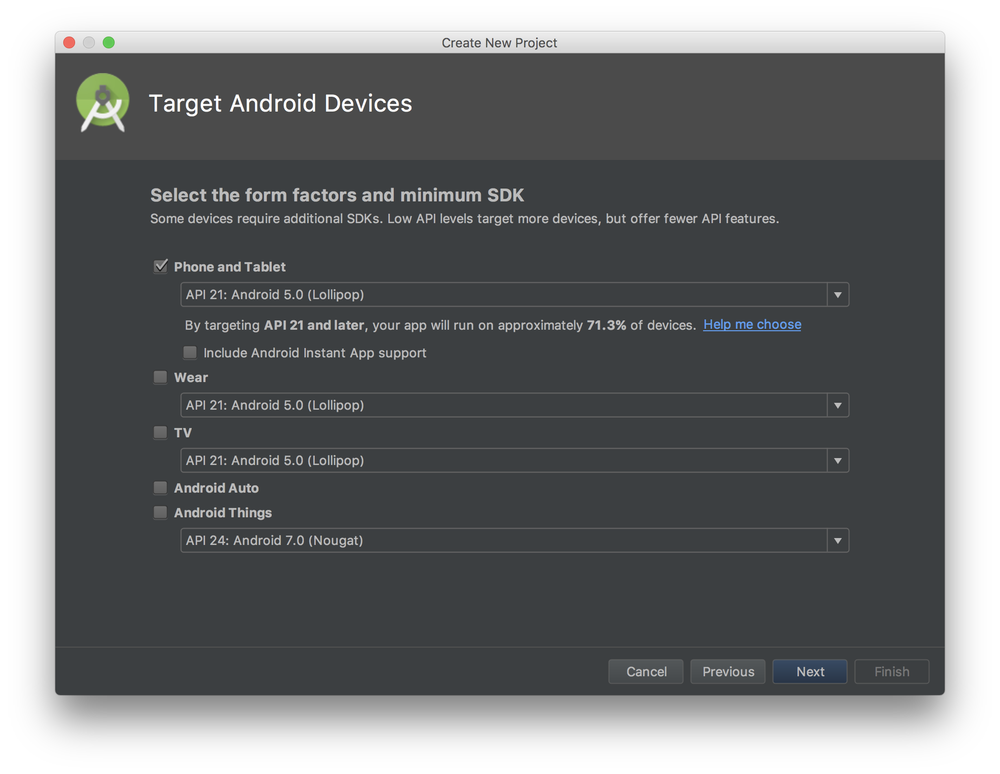
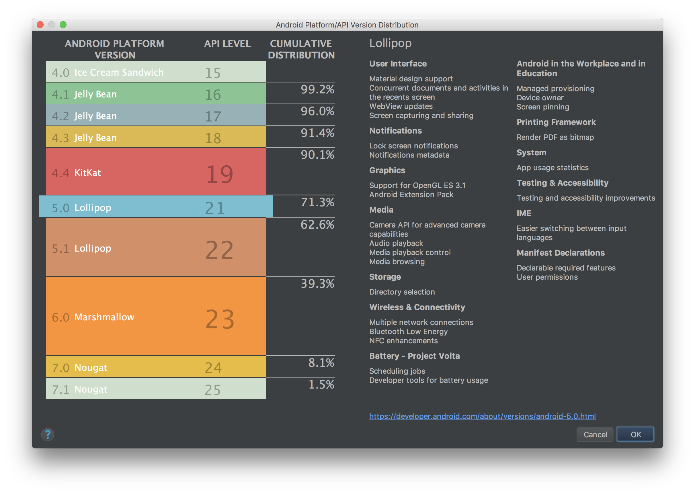
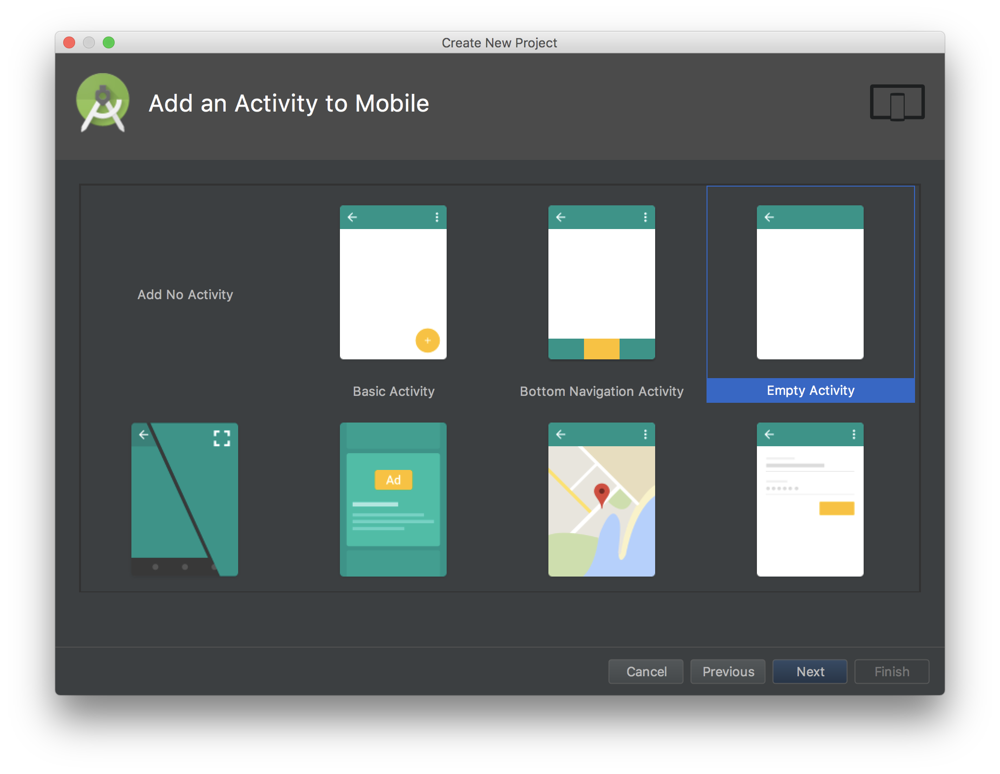
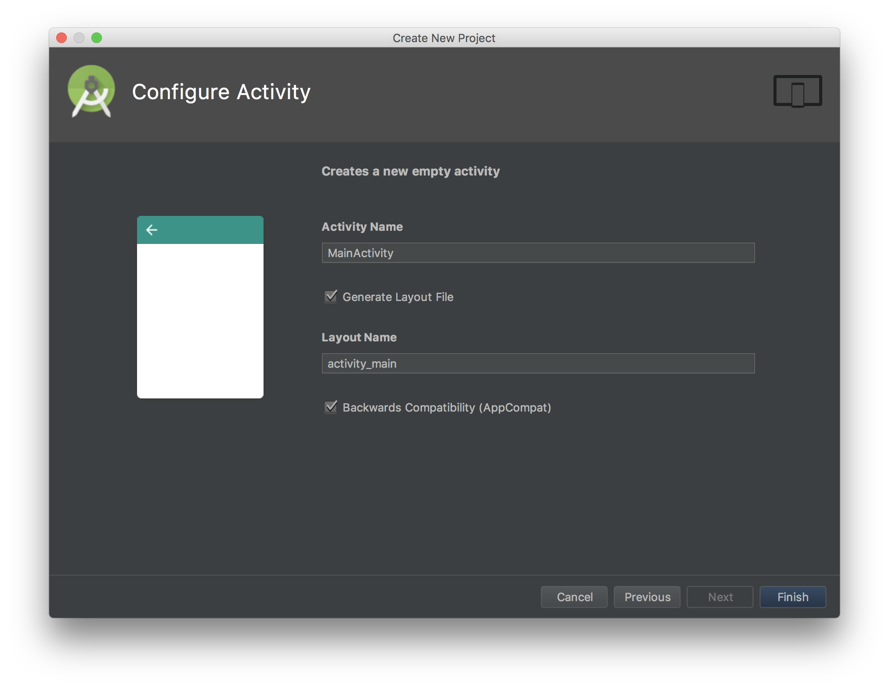
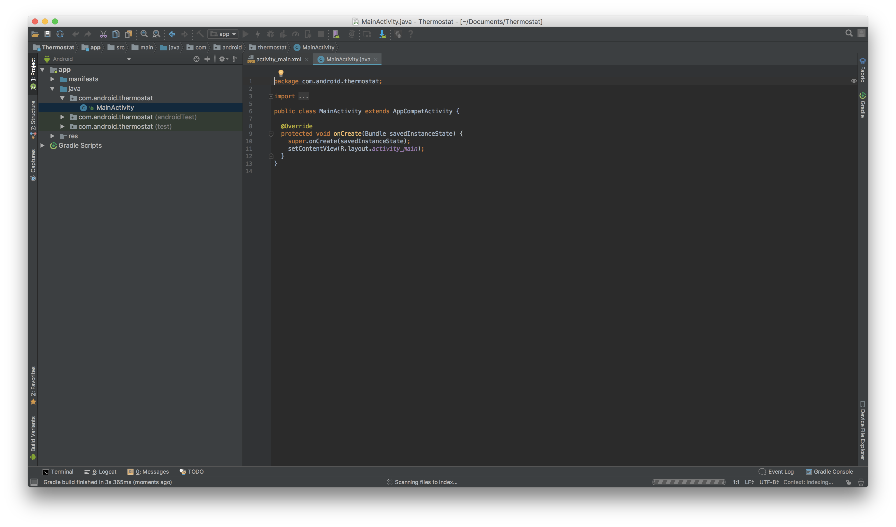
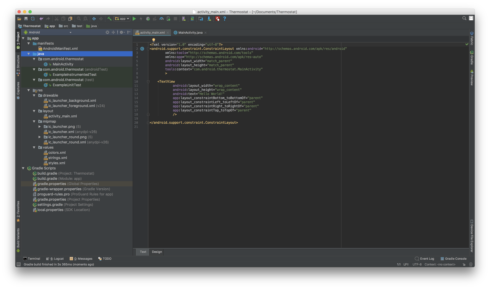

## Part one

Setting Up The Project
------

#### 1. Open Android Studio

   

#### 2. Create new project

   Select the 1st option - __Start a new Android Studio Project__

#### 3. Enter application name and domain name

   

   Feel free to name the app with any name that you like!
   Look under **Package name**: You will see the text here update as you make changes in the *Application name* and *Company domain* fields.
   This will be the unique name of your application package.

   **Note:** Uncheck the __Include Kotlin support__ box. This workshop will be in Java, so we don’t need Kotlin in our project at this point.

   Press **Next** when you are ready.

#### 4. Set minimum API

   

   We are fine with selecting the default.

   ### Why set minimum API?

   If you select the **Help me choose** link, you’ll see the following breakdown in Android Studio:

   

    API levels refer to the different Android versions (e.g. _Kitkat, Lollipop, Oreo_)

   Choosing the API level to support is often dependent on the project aims and requirements. A lower API minimum support level will mean more people can potentially use the app; at the same time, things might have to be developed differently in order to support different API levels.

   There is no fixed minimum API level, the default set is what’s recommended, there’s no need to follow this all the time.

   Press **Next**.

#### 5. Choose an Activity

   

   Android Studio will create an empty application with the layout you select here.

   For simplicity, let’s select **Empty Activity**

   Press **Next** when you are done.

#### 6. Review Activity details and Finish!

   

   Here you can rename the layout file (XML) and the logic file (Java).

   This is not necessary at this stage, so we can leave this and press finish!

   All the necessary files will be generated for you and ‘Hello World’ is ready to be run immediately.

## What our project now looks like

We have a `MainActivity.java` file - this will be where we’ll be adding the logic to.

We also have a `activity_main.xml` file - this will be where we’ll be defining the layout.

Feel free to explore the folders to see what was automatically generated, and to familiarise yourself with the application components/structure.

## Running and Testing our Application

You can either run the app on your phone directly; alternatively you can run it on an emulator.

   **Emulator:** For emulator set-up, please follow the following guide: [Emulator Guide](https://developer.android.com/studio/run/managing-avds.html)

   **Device:** For device set-up, you will need to enable __Developer Options__ on your phone: [Enable Developer Options Guide](https://developer.android.com/studio/debug/dev-options.html#enable)

Once you have set it up, you’ll just need to press the __Run App__ button:

And then select the device you want to run it on:

When you are ready, let’s move on to [Part two](../Part-2/instructions.md).
