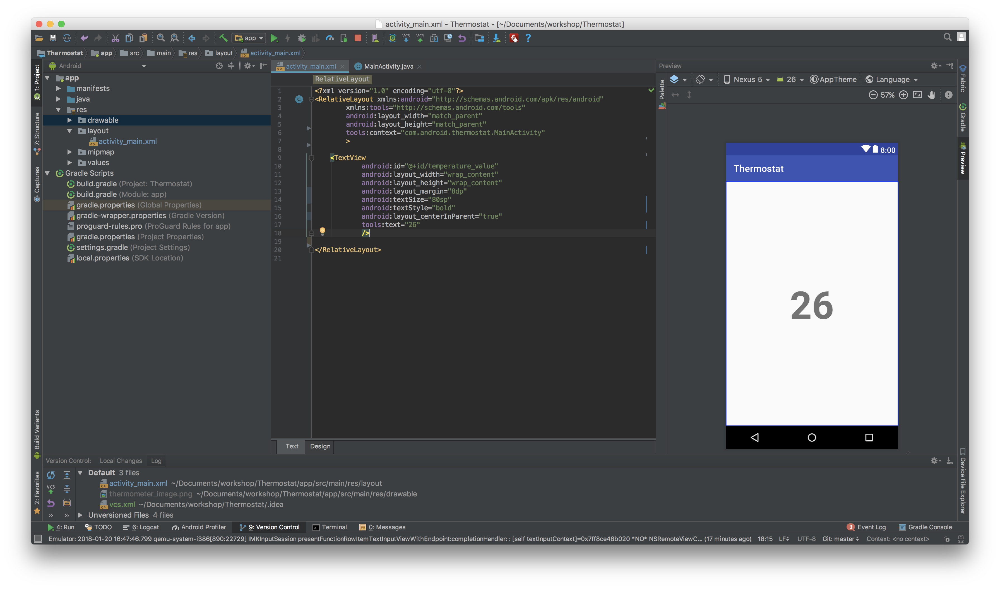
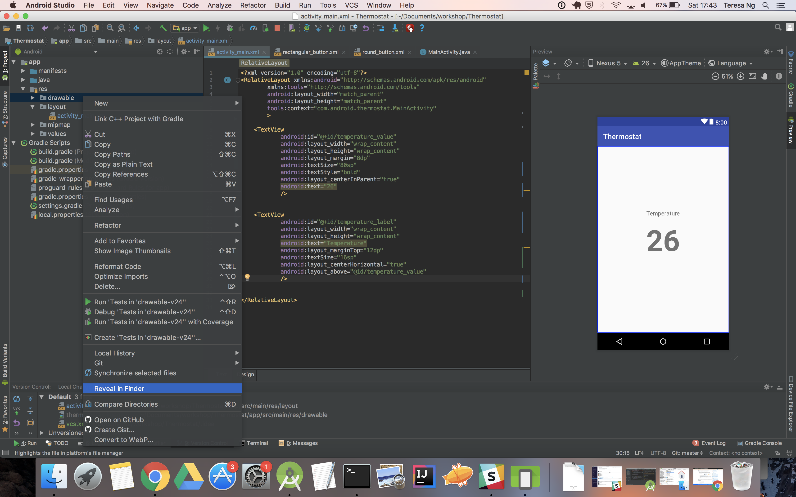
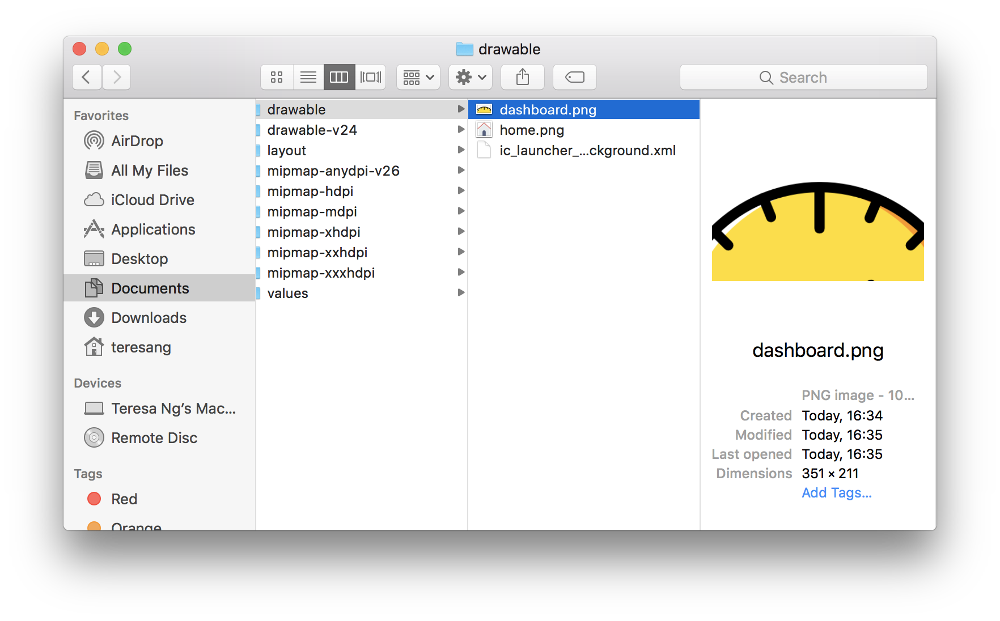
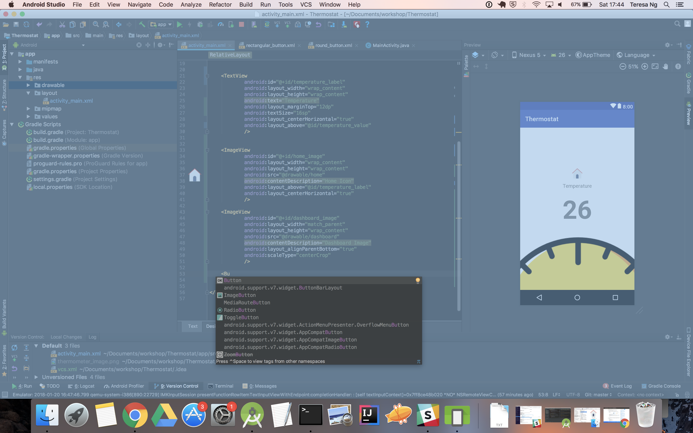
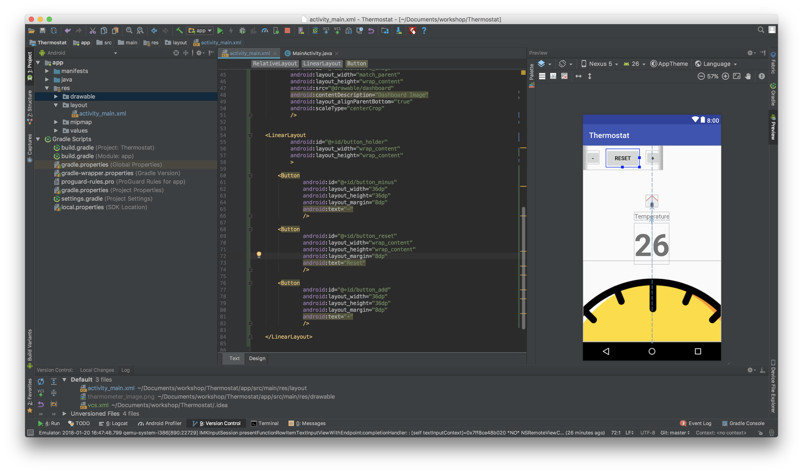
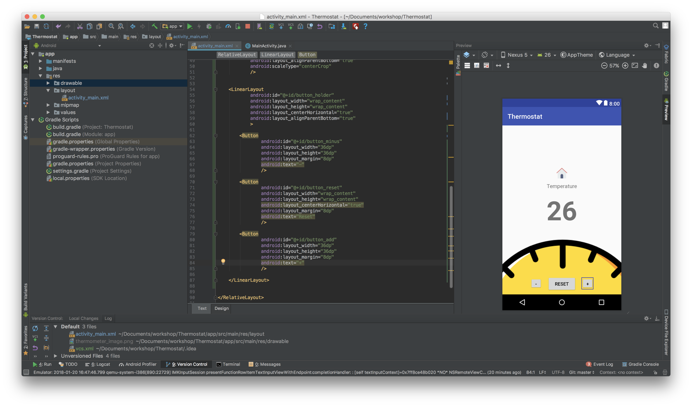
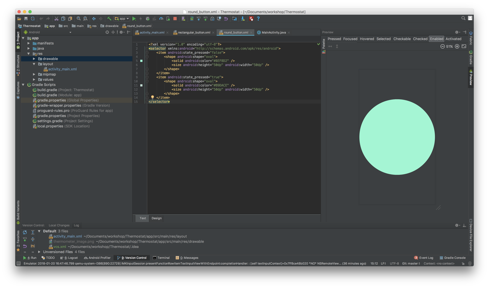
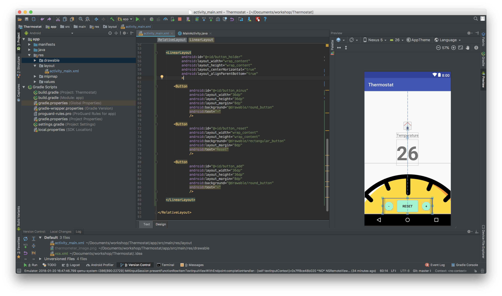
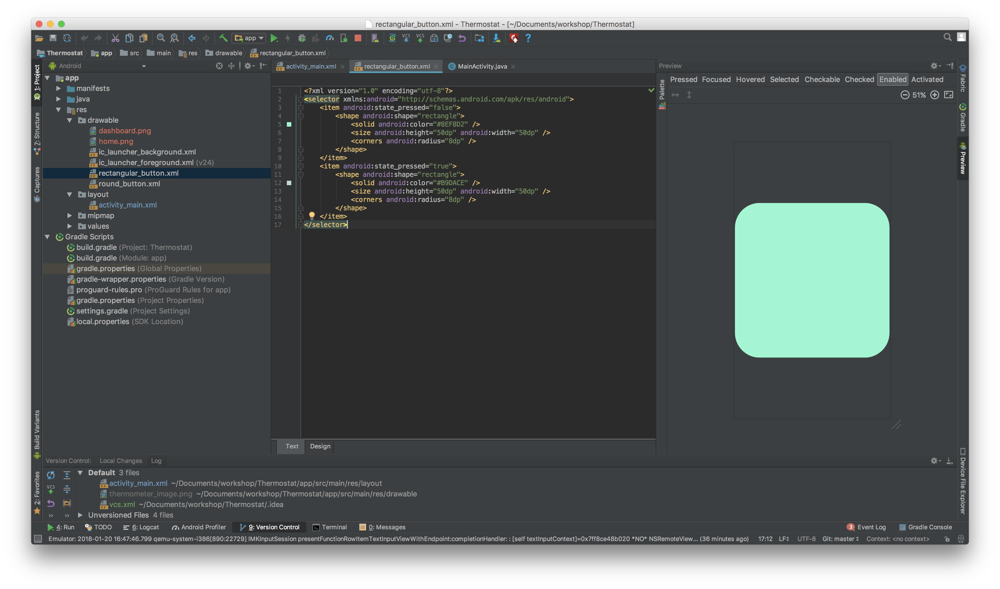

# intro-to-android-workshop
## Part two

Let’s Start Building the App Layout
------

1. Open the layout file

   Navigate to `activity_main.xml` and double click to open it.
   
   

   The file contains a `<ConstraintLayout>` and a `<TextView>`
      + Android Studio has automatically generated this. ConstraintLayout is a very powerful layout for complicated screens but we do not need something as complex as a ConstraintLayout yet so let’s change this to `<RelativeLayout>`

2. Change the layout to a Relative layout

   Select the start of the `<ConstraintLayout>` and enter `RelativeLayout`. Android Studio should automatically change the closing tag for you.

   

3. Amend the TextView

   Change the `android:text` value from `Hello World!` to `Temperature`

   We can delete the `app:layout` lines - these were originally for the ConstraintLayout and were used to define which part of the screen the TextView shows.

   Let’s make this in the centre - with `android:layout_centerHorizontal = true`

   It’s too close to the top so let’s add a margin - with `android:marginTop = 24dp`

   Let’s also increase the font size - with `android:textSize = 16sp`

   *Note*: `dp` and `sp` are units of measurements. `dp` stands for _Density pixel_ while `sp` stands for _Scalable Pixel_. We often use `dp` for sizes of views and spaces in between, and `sp` for text only.

   For more information, feel free to read the explanation in the [material.io guidelines](https://material.io/guidelines/layout/units-measurements.html)

   Add an `android:id` to this TextView - doing so will allow us to locate and identify our TextView in code. Let’s call this `@+id/temperature_label`

   **Note**: You cannot have uppercase characters or spaces in the name. Therefore in order for the names to remain readable while making them more meaningful, we’ve used the underscore to separate the words.

4. Add another TextView

   

   Go to a new line and start typing `<TextView…` - Android Studio should auto-populate the details for you. Press enter to accept.

   `android:height` and `android:width` are required and must be defined. There are 2 commonly used values - `wrap_content` and `match_parent`.
      * `wrap_content`: the size of the view will match it’s contents
      * `match_parent `: the size of the view will match it’s parent

   `wrap_content` will suit our needs here.

   We also want this to be in the centre, so set `android:layout_centerHorizontal = true`

   Let’s enter something here - with `android:text = 26`

   We want this to be more prominent than our _Temperature_ view, so let’s specify the text size to _36sp_. We can also specify whether this is *bold* or _italics_ - let’s have this *bold* so set the `android:textStyle = bold`.

   Notice that the new view overlaps the preview view? We now need to tell the layout to place our new TextView below the previous TextView.

   In order to do so, we need to enter `android:layout_below` and after `=` enter the ID of the TextView we want to align below. As we’ve named the first TextView which says “Temperature” `@+id/temperature_label`, we can start typing `temperature_label` and Android Studio will automatically complete this for you.

   **Note**: It will now say this - `android:layout_below = @id/temperature_label`. Where has the `+` gone? Well, when we’re defining the name of the layout, we have to enter `@+id` at the start to specify _adding a new ID_. That’s why when we refer to this after creation we no longer need to tell Android Studio to add a new ID.

   Now that this is done, we’ll need to give this view an ID too.

5. Import the Image

   Locate the `res/drawable` folder in the sidebar and right click. You’ll see this:

   

   Close to the bottom there is a _Reveal in Finder_ option. Select this. 
   
   

   This will open up a window showing where your drawable resources are saved in your computer. Paste a copy of the image file in this folder.

   

   We can now use this file in our project!

6. Add the Image View

   

   In order to display images in our app, we need to add an `ImageView`. Like `TextView`, `ImageView` is a _View_ and it allows us to specify how we want our image to be displayed.

   We specify which image file to use by entering the file name in `android:src` - so `android:src=“@drawable/thermometer_image` will allow us to display our thermometer image.

   In order for the image view to appear below our `TextViews`, let’s add an ID, margins and `centerInParent`

   

7. Change the background colour

   In the `RelativeLayout` tag, let’s specify the background colour as `android:background=“#EFBE57”`

   

   That’s all it is required to change the background, you can also change the background to another image etc.

8. Add Buttons

   Let’s add buttons to allow users to interact with our app.

   Start typing `<Button…` and press enter to select the first option.

   

   Then fill in the details like so:
   
   

   Add another button, this time labelling it as `button_add`

   We’ll like to have the buttons side-by-side so let’s put them in a nested layout. Remember when we started we created a layout called `RelativeLayout`? A nested layout refers to a layout within a layout.

   This time, let’s add a `LinearLayout`.

   

   `LinearLayout`s are useful when we want to display our views in a linear-fashion, be it horizontally or vertically. Unlike the `RelativeLayout` where you had to specify the relationships of the views, there is no need to do this in a `LinearLayout` as the following views are always placed below (in a vertical `LinearLayout`) or on the right of (in a horizontal `LinearLayout`) of the view before it.

   As we want our add button to be on the right of the minus button, a `android:orientation=“horizontal”` would work for us.

   

   Like any other view, we can then specify where we’re going to place this `LinearLayout`. The benefit of using a nested layout is also evident here - notice how both views moved simultaneously?

   After you’ve done this, add another button and name it `button_reset`

###Bonus: Let’s make the buttons pretty

   The default colour and shape for buttons might not work best for our app. We can change both the colour and shape of our buttons very easily by using an XML drawable called a `selector`.

   Like how we’re building our layouts in XML, Android Studio also allows us to build drawables in XML. The `selector` allows us to specify the appearance of this drawable at different states - like when the button is pressed and when it isn’t pressed. Within this drawable we’ll have a `shape` tag. We can create an XML drawable simply as a `shape` without the `selector`. 

  For now, let’s have a look at how we can build this `selector` with the shapes.

9. Create a selector

   Right-click the menu on the left again and select _New\Drawable Resource File_

   

   Name it `round_button`

   

   Replace the code in the file with the following:

   ```
   <?xml version="1.0" encoding="utf-8"?>
<selector xmlns:android="http://schemas.android.com/apk/res/android">
    <item android:state_pressed="false">
        <shape android:shape="oval">
            <solid android:color="#8EF8D2" />
            <size android:height="50dp" android:width="50dp" />
        </shape>
    </item>
    <item android:state_pressed="true">
        <shape android:shape="oval">
            <solid android:color="#B9DACE" />
            <size android:height="50dp" android:width="50dp" />
        </shape>
    </item>
</selector>
```

   

   Now we can apply it to our buttons by setting the drawable as a background

   

   We can adjust the size and spacing of the buttons to make them look a bit better

   

   Now let’s create another drawable for our reset button as we don’t want this button to be a round button. This time around, we’ll make it a rounded rectangle (so `rectangular_button` will make a good name) with the following code:

   ```
   <?xml version="1.0" encoding="utf-8"?>
<selector xmlns:android="http://schemas.android.com/apk/res/android">
    <item android:state_pressed="false">
        <shape android:shape="rectangle">
            <solid android:color="#8EF8D2" />
            <size android:height="50dp" android:width="50dp" />
            <corners android:radius="8dp" />
        </shape>
    </item>
    <item android:state_pressed="true">
        <shape android:shape="rectangle">
            <solid android:color="#B9DACE" />
            <size android:height="50dp" android:width="50dp" />
            <corners android:radius="8dp" />
        </shape>
    </item>
</selector>
```

   

   Add it to the reset button as a background like before.

   

  And play around with the margins to make everything look a bit better!

   


If you run the app now, you’ll see all your changes on your emulator/phone.

But nothing happens when you press the buttons!

Let’s start to make things work - [Part three](../Part-3/instructions.md).
