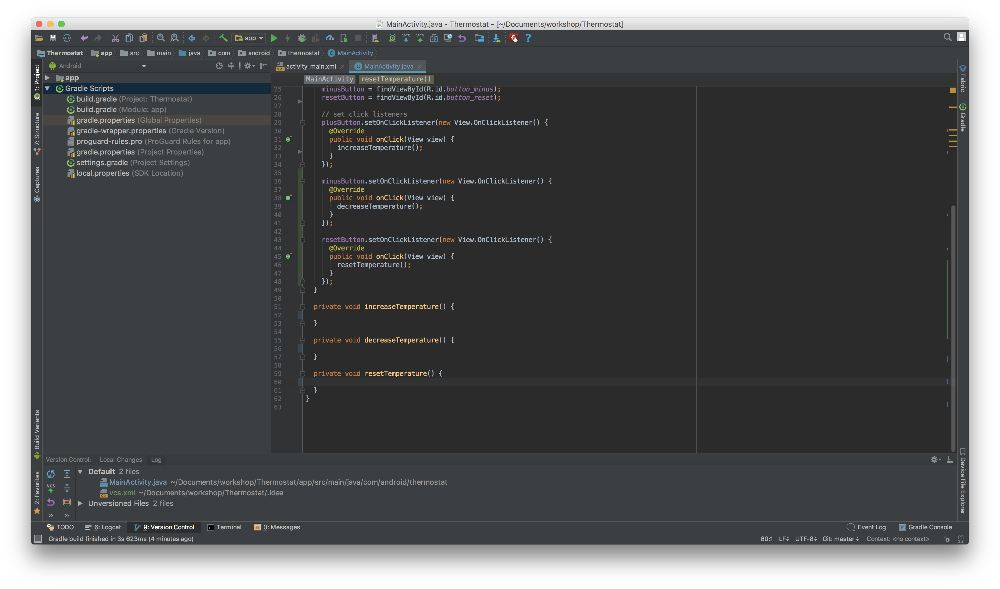
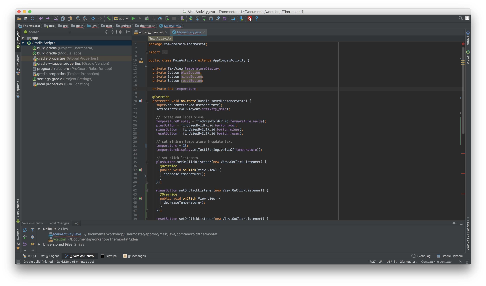
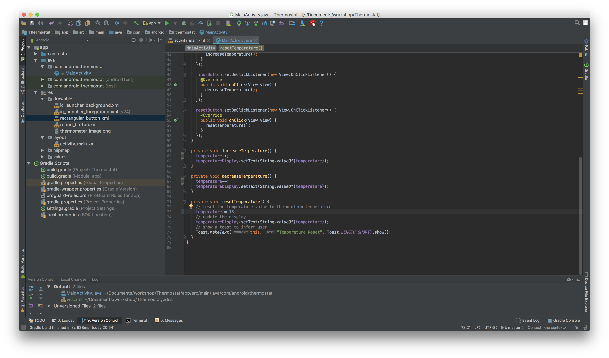
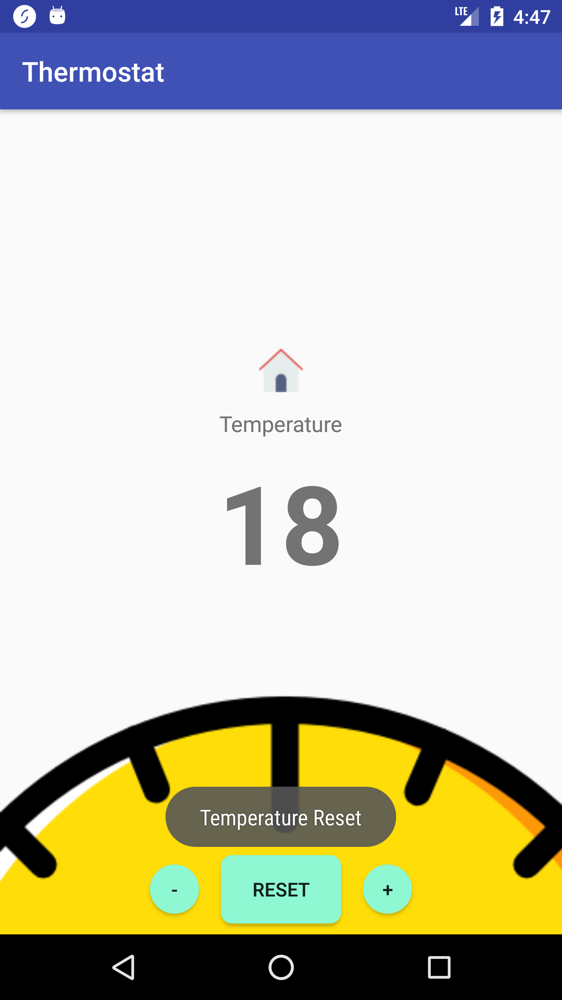

## Part four

Adding More Logic to the App
------

In the final part of the workshop, we’ll have the temperature value at the top of the screen update whenever the add and minus buttons are clicked, and the value reset when the reset button is pressed.

#### 1. Replace the Toasts with methods

   In order to make our code more readable, let’s separate the actions for each of our `onClickListeners` into separate methods - `increaseTemperature()`, `decreaseTemperature()` and `resetTemperature()` like so:

   

#### 2. Create a global variable and set a starting temperature

   Below all the previously declared fields, add the following:

   ```java  
   private int temperature;
   ```

   This will allow us to store and reference the value in our methods.

   Let’s set an initial value in our `onCreate` method and update the view with it:

   ```java    
   // set minimum temperature & update text
    temperature = 18;
    temperatureDisplay.setText(String.valueOf(temperature));
   ```

   You can add any integer value instead of 18 if you like!

   As _temperatureDisplay_ is a _TextView_, we cannot simply tell it to set an `Integer` directly. We first need to convert the `Integer` to a `String`. That’s what `String.valueOf(Integer)` does.

   Our Java file should now look something like this:

   


#### 3. Add the logic for the add button

   We want the temperature to increase by one when we press the add button.

   You can of course, just update the text in the display directly with `temperatureDisplay.setText(temperature+1)`. Give this a go. What did you notice?

   So in order for the text to update incrementally, we need to 1) Update the temperature variable and 2) Display the updated value

   In order to update the variable, we can simply add the following line:

   ```java
   temperature++;
   ```

   This is equivalent to writing this:

   ```java
   temperature = temperature + 1;
   ```

   Now that we’ve updated the variable, let’s update our temperature label view as well:

   ```java
   temperatureDisplay.setText(String.valueOf(temperature));
   ```

#### 4. Add the logic for the minus button

   We want the temperature to decrease by one when we press the minus button. Just like before, we need to 1) Update the temperature variable and 2) Display the updated value

   In order to update the variable, we can simply add the following line:

   ```java
   temperature—-;
   ```

   This is equivalent to writing this:

   ```java
   temperature = temperature - 1;
   ```

   Now that we’ve updated the variable, let’s update our temperature label view as well:

   ```java
   temperatureDisplay.setText(String.valueOf(temperature));
   ```

#### 5. Add the logic for the reset button

   When we press _reset_, we want the temperature to be reset to the original temperature. Sometimes the user might press the reset button when it’s already at the original temperature. In such cases, it’s good to give some feedback to the user, so let’s leave the toast here but update the message.

   In our `resetTemperature` method, add the following code:

   ```java    
   // reset the temperature value to the minimum temperature
    temperature = MINIMUM_TEMPERATURE;
    // update the display
    temperatureDisplay.setText(String.valueOf(temperature));
    // show a toast to inform user
    Toast.makeText(this, "Temperature Reset", Toast.LENGTH_SHORT).show();
   ```

   Run the app and check that the toast appears and the temperature label is reset.


Our code should now look something like this:

   


Run and app and play around with it:

   


Congratulations! You have completed your first app! :)

**Next Steps**: Why not check out these other [Android Learning Resources](../resources.md)?
